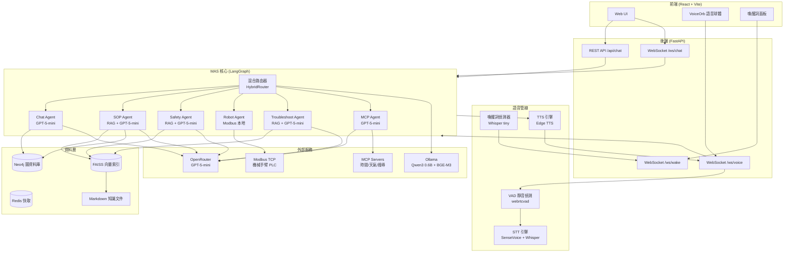
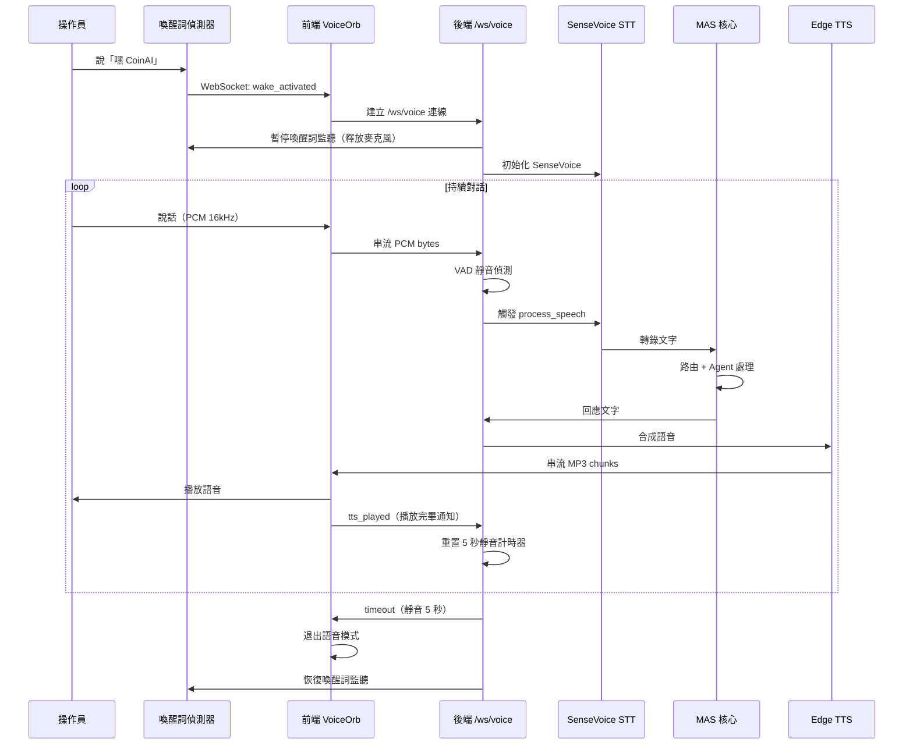
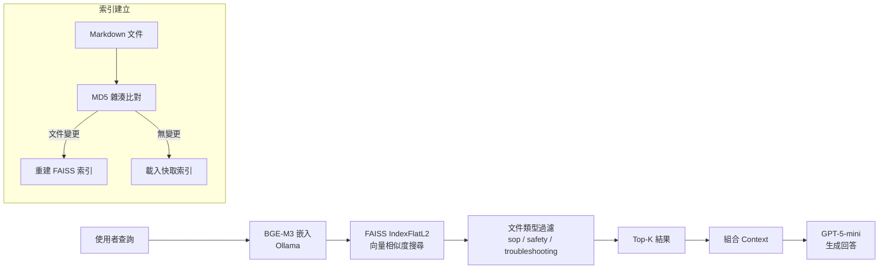
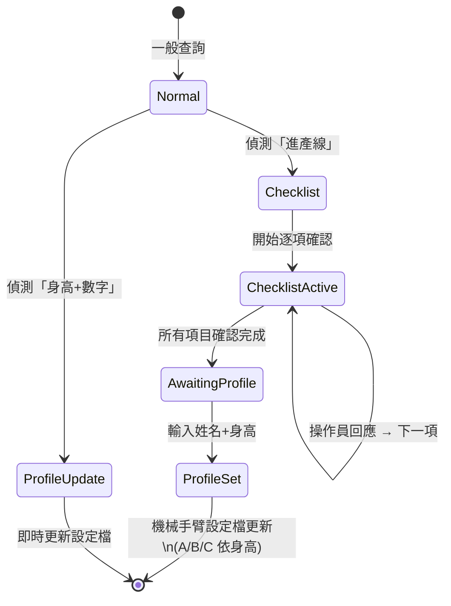
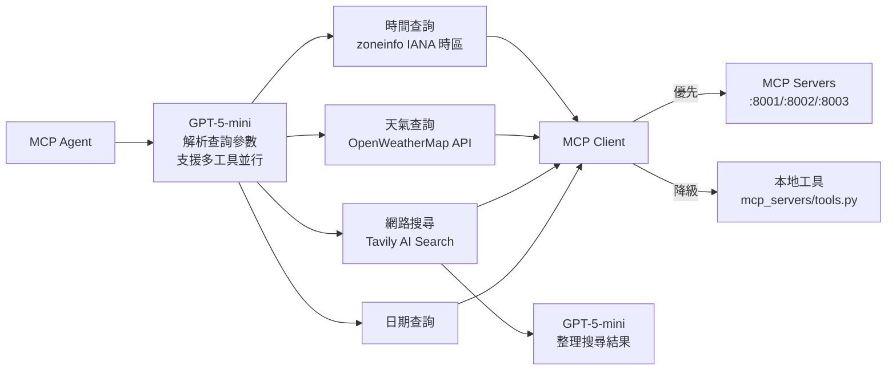
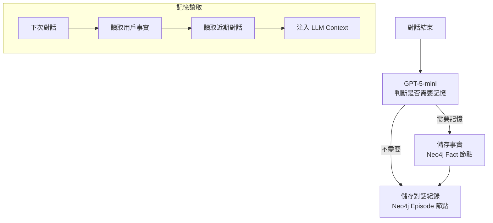

# 系統設計文件 (System Design Document)

**專案名稱：** CoinAI MAS — 顯示卡產線多代理人智慧助理系統  
**版本：** v1.0  
**日期：** 2026-03-27  

---

## 1. 系統概述

CoinAI MAS 是一套部署於顯示卡組裝產線的多代理人系統（Multi-Agent System），提供操作員語音與文字雙模式互動介面。系統整合本地 LLM 路由、RAG 知識檢索、Modbus 機械手臂控制、MCP 外部資訊查詢，以及 Neo4j 長期記憶，實現低延遲、高準確度的產線智慧輔助。

### 1.1 核心目標

- 操作員可透過自然語言（中/英/越/印尼語）控制機械手臂、查詢 SOP、確認安全規範
- 路由延遲 < 100ms（規則命中）/ < 500ms（Qwen 0.6B 推論）
- 支援喚醒詞觸發、持續語音對話、TTS 語音回覆
- 人因工程設計：依操作員身高自動調整機械手臂參數

### 1.2 技術棧

| 層級 | 技術 |
|------|------|
| 前端 | React + Vite, WebSocket |
| 後端 | FastAPI, LangGraph |
| 路由 LLM | Qwen3 0.6B (Ollama, 本地) |
| 推理 LLM | GPT-5-mini (OpenRouter → OpenAI) |
| STT | SenseVoice-Small + Whisper (備援) |
| TTS | Edge TTS (Microsoft) |
| RAG | FAISS + BGE-M3 (Ollama) |
| 長期記憶 | Neo4j + LLM 提取 |
| 機械手臂 | Modbus TCP |
| 外部資訊 | MCP (時間/天氣/搜尋) |

---

## 2. 系統架構

### 2.1 整體架構圖



---

## 3. 多代理人工作流程

### 3.1 LangGraph 狀態機流程

```mermaid
flowchart TD
    START([使用者輸入]) --> StateCheck{狀態鎖定檢查}

    StateCheck -->|Checklist 進行中\n或等待身高輸入| Safety
    StateCheck -->|正常| LangDetect[語言偵測\nlangid]

    LangDetect --> RuleCheck{規則攔截器\n_rule_based_check}

    RuleCheck -->|機械手臂指令\n伸出/夾取/放置/速度| Robot[Robot Agent\n本地 Modbus]
    RuleCheck -->|進產線/身高更新| Safety[Safety Agent]
    RuleCheck -->|步驟/流程/SOP| SOP[SOP Agent]
    RuleCheck -->|時間/日期/天氣/搜尋| MCP[MCP Agent]
    RuleCheck -->|未命中| Qwen[Qwen3 0.6B\nTool Calling 路由]

    Qwen -->|control_robot| Robot
    Qwen -->|query_sop| SOP
    Qwen -->|query_safety_guidelines| Safety
    Qwen -->|troubleshoot| Trouble[Troubleshoot Agent]
    Qwen -->|mcp_query| MCP
    Qwen -->|無 tool call| Chat[Chat Agent]

    Robot --> END([回應使用者])
    MCP --> END

    SOP --> RedirectCheck{二次路由檢查\n_detect_redirect}
    Safety --> RedirectCheck
    Trouble --> RedirectCheck
    Chat --> END

    RedirectCheck -->|route to safety| Safety
    RedirectCheck -->|route to sop| SOP
    RedirectCheck -->|route to troubleshoot| Trouble
    RedirectCheck -->|無標記| END
```



### 3.2 語音互動流程



---

## 4. 核心模組設計

### 4.1 混合路由器 (HybridRouter)

路由策略採三層優先級：

```
優先級 1：狀態鎖定（Checklist 進行中 → 強制 Safety Agent）
優先級 2：規則攔截器（關鍵字比對，~0ms）
優先級 3：Qwen3 0.6B Tool Calling（~50-200ms）
備援：Fallback → Chat Agent
```

**規則攔截覆蓋場景：**

| 觸發條件 | 路由目標 | 範例 |
|----------|----------|------|
| 伸出/夾取/放置/速度關鍵字 | Robot Agent | 「機械手臂伸出」 |
| 進產線/身高+數字 | Safety Agent | 「我要進產線了」 |
| 步驟/流程/SOP/第N步 | SOP Agent | 「第三步怎麼做」 |
| 幾點/時間/天氣/搜尋/上網查 | MCP Agent | 「現在幾點」 |

### 4.2 RAG 知識檢索



**文件類型：**
- `sop` — 顯示卡組裝標準作業程序（12 步驟）
- `safety` — 作業安全須知與操作規範
- `troubleshooting` — 異常狀況處理指南

### 4.3 Safety Agent 狀態機

Safety Agent 內建進產線核對清單流程：



**身高設定檔：**

| 設定檔 | 身高範圍 | 機械手臂伸出值 |
|--------|----------|----------------|
| A | > 180 cm | 4（較高位置）|
| B | 170–180 cm | 3（中等位置）|
| C | < 170 cm | 2（較低位置）|

### 4.4 MCP 外部資訊架構



### 4.5 長期記憶架構



---

## 5. API 介面規格

### 5.1 REST API

| 端點 | 方法 | 說明 |
|------|------|------|
| `/api/chat` | POST | 文字對話 |
| `/api/status` | GET | 系統狀態（機械手臂、操作員資訊）|
| `/api/stats` | GET | 統計資料（請求數、延遲、路由分布）|
| `/api/wake/settings` | GET/POST | 喚醒詞設定 |
| `/api/voice/upload` | POST | 上傳音訊檔轉錄 |

**POST /api/chat 請求/回應：**

```json
// Request
{ "message": "機械手臂伸出", "session_id": "default" }

// Response
{
  "response": "✅ 機械手臂已伸出至組裝位置。(設定檔: B, 值: 3)",
  "route": "robot",
  "model_used": "rule",
  "latency_ms": 12.3,
  "tool_name": "control_robot",
  "modbus_result": { "register": 1024, "value": 3 },
  "detected_language": "zh"
}
```

### 5.2 WebSocket 協議

**`/ws/voice` 訊息格式：**

| 方向 | 類型 | 說明 |
|------|------|------|
| 前端 → 後端 | `ArrayBuffer` | PCM 16kHz 16-bit 音訊 |
| 前端 → 後端 | `{"type":"interrupt"}` | 打斷 TTS 播放 |
| 前端 → 後端 | `{"type":"tts_played"}` | 通知後端播放完畢 |
| 後端 → 前端 | `{"type":"state","state":"listening"}` | 狀態更新 |
| 後端 → 前端 | `{"type":"transcript","text":"..."}` | STT 結果 |
| 後端 → 前端 | `{"type":"response","text":"..."}` | MAS 回應 |
| 後端 → 前端 | `ArrayBuffer` | TTS MP3 音訊 chunks |
| 後端 → 前端 | `{"type":"tts_end"}` | TTS 串流結束 |
| 後端 → 前端 | `{"type":"timeout"}` | 靜音 5 秒，退出語音模式 |

---

## 6. 資料流與狀態管理

### 6.1 LangGraph MASState

系統使用 `TypedDict` 定義跨節點共享狀態：

```
MASState
├── 輸入層
│   ├── user_input: str
│   └── detected_language: str
├── 路由層
│   ├── route_decision: str
│   ├── needs_gpt: bool
│   └── intent_confidence: float
├── 工具層
│   ├── tool_name: str
│   ├── tool_args: dict
│   └── tool_result: str
├── 回應層
│   ├── agent_response: str
│   ├── model_used: str
│   ├── next_agent: str        ← 二次路由標記
│   └── redirect_reason: str
├── 硬體層
│   └── modbus_result: dict
├── 操作員層
│   ├── operator_name: str
│   ├── operator_height: float
│   └── height_profile: str    ← A/B/C
├── Checklist 層
│   ├── checklist_active: bool
│   ├── current_checklist_index: int
│   └── awaiting_name_height: bool
└── 元數據層
    └── latency_ms: float
```

### 6.2 跨請求狀態持久化

`api/server.py` 維護 `_context_state` 字典，在 HTTP 請求間保持：
- `checklist_active` — 核對清單進行狀態
- `operator_name/height/height_profile` — 操作員資訊
- `awaiting_name_height` — 等待身高輸入狀態

---

## 7. 部署架構

### 7.1 服務拓撲

```
┌─────────────────────────────────────────────┐
│  Windows 工作站                              │
│                                             │
│  ┌──────────┐  ┌──────────┐  ┌──────────┐  │
│  │ MCP Time │  │MCP Weather│  │MCP Search│  │
│  │ :8001    │  │ :8002    │  │ :8003    │  │
│  └──────────┘  └──────────┘  └──────────┘  │
│                                             │
│  ┌─────────────────────────────────────┐    │
│  │  FastAPI Backend  :8000             │    │
│  │  (uvicorn + LangGraph + STT/TTS)    │    │
│  └─────────────────────────────────────┘    │
│                                             │
│  ┌──────────┐  ┌──────────┐                │
│  │  Ollama  │  │  Docker  │                │
│  │ :11434   │  │ Neo4j    │                │
│  │ Qwen3    │  │ :7687    │                │
│  │ BGE-M3   │  │ Redis    │                │
│  └──────────┘  │ :6379    │                │
│                └──────────┘                │
│                                             │
│  ┌─────────────────────────────────────┐    │
│  │  React Frontend  :5173              │    │
│  └─────────────────────────────────────┘    │
└─────────────────────────────────────────────┘
         │
         ▼ HTTPS/WSS
┌─────────────────────┐
│  OpenRouter API     │
│  GPT-5-mini         │
└─────────────────────┘
```

### 7.2 啟動順序

1. `docker-compose up -d` — 啟動 Neo4j + Redis
2. `ollama serve` — 啟動 Ollama（需預先 pull qwen3:0.6b, bge-m3）
3. MCP Servers（:8001, :8002, :8003）
4. FastAPI Backend（:8000）
5. React Frontend（:5173）

---

## 8. 效能特性

| 場景 | 延遲 | 模型 |
|------|------|------|
| 機械手臂控制（規則命中）| ~5ms | 規則引擎 |
| SOP/安全查詢（Qwen 路由）| ~200ms 路由 + ~3s LLM | Qwen + GPT-5-mini |
| 語音辨識（SenseVoice）| ~70ms / 10s 音訊 | SenseVoice-Small |
| TTS 合成（Edge TTS）| ~300-800ms | Edge TTS |
| 網路搜尋（Tavily）| ~2-5s | Tavily + GPT-5-mini |

---

## 9. 安全性設計

- API Key 透過 `.env` 管理，不進版本控制
- OpenRouter 強制指定 `provider: OpenAI`，避免路由至 Azure（內容政策限制）
- Modbus 預設 Mock 模式（`MODBUS_MOCK=true`），需明確啟用才連接實體設備
- WebSocket 語音連線限制單一活躍連線，防止資源競爭

---

## 10. 已知限制與待優化項目

| 項目 | 說明 |
|------|------|
| 對話歷史跨請求遺失 | 目前 `conversation_history` 不在 `_context_state` 中持久化 |
| BGE-M3 依賴 Ollama | RAG 向量檢索需要 Ollama 運行，否則降級為無向量模式 |
| SenseVoice 首次載入慢 | 模型 ~944MB，首次載入需 10-30 秒 |
| 二次路由無深度限制 | 理論上可能發生 SOP ↔ Safety 無限迴圈（實務上 LLM 不會重複觸發）|
